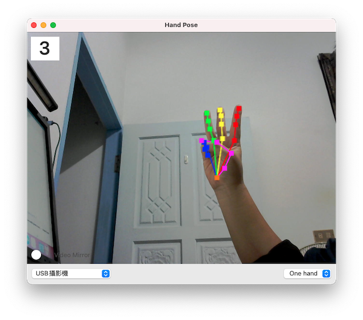

# Hand Pose Demo App for macOS

- 使用 AV Foundation 存取 Webcam。
- 使用 Vision framework 做手部姿勢檢測。

 

## 手部姿勢判斷

## 思路說明

### Fingers 姿勢判斷：

我想到兩種方式來判斷四隻手指 (fingers) 的收放：

- 方式一：當手指節點`TIP`到手腕`Wrist`的距離 *與* 節點`DIP`到手腕`Wrist`的距離 *小於* 節點`MCP`到手腕`Wrist`的距離時，判斷為手指收起來，反之為張開。
- 方式二：比較手指各節點(`TIP`、`DIP`、`PIP`、`MCP`)到手腕`Wrist`的距離，當距離：TIPToWrist > DIPToWrist > PIPToWrist > MCPToWrist 時，手指判斷為張開，反之為收起來。

在這個 App 裡，我採用了`方式一`。 

(註：更好的作法是結合`一`、`二`兩種方式，當符合`方式一`時判斷手指為收起來，符合`方式二`時判斷手指是伸直張開，當*不符合方式一也不符合方式二* 時，則手指是未知或是彎曲狀態。不過這個 App 只是個 Demo 程式，所以我不打算在細節上著墨太多，有興趣的人可以自行嘗試。)

### Thumb 姿勢判斷：

判斷大拇指的收放，我想到的方式是：

1. 計算大拇指`TIP` (thumbTip) 到食指`MCP` (indexMCP) 的距離，與計算大拇指`TIP` (thumbTip) 到中指`MCP` (middleMCP) 的距離，然後比較這兩個距離，當 thumbTipToMiddleMCP < thumbTipToIndexMCP 時，也就是大拇指的指尖距離中指的尾端比較近時 (相對於食指尾端)，判定大拇指為收起來，反之為張開。
2. 計算大拇指`TIP` (thumbTip) 到手腕`Wrist`的距離，與計算大拇指`IP` (thumbIP) 到手腕`Wrist`的距離，然後比較這兩個距離，當 thumbTipToWrist < thumbIPToWrist 時，判定大拇指為收起來，反之為張開。

在這個 App 裡，我同時採用了`1.`、`2.`兩種方式。

## 其他

關於手指 (Fingers) 與大拇指 (Thumb) 各節點的位置與名稱，我擷取了 [Detect Body and Hand Pose with Vision](https://developer.apple.com/videos/play/wwdc2020/10653/) 這個 session 的兩個畫面給各位參考：

想知道更多關於 iOS/macOS 姿勢檢測 API 的資訊，可參考 WWDC 2020 的影片：[Detect Body and Hand Pose with Vision](https://developer.apple.com/videos/play/wwdc2020/10653/)。

